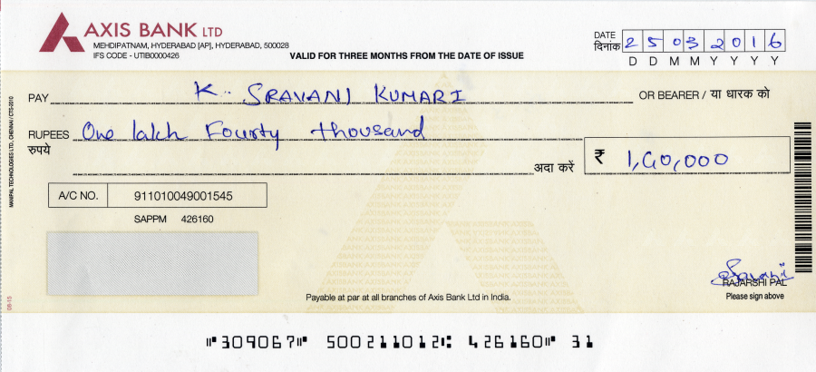

# OCR + CV pipeline for Cheque Field Extractor

A Flask app that reads Indian bank cheques and pulls out the fields you
actually need — Bank Name, Branch Address, Account Number, IFSC Code, and
Payer Name — from a photo of the cheque. Built on PaddleOCR with a
purpose-built classification layer on top (no generic template matching or
external cheque-parsing API).

## Demo

**Input** — a photo of a physical cheque, uploaded as-is (no manual cropping
or alignment required):



**Output** — extracted fields, streamed field-by-field as they're found and
shown in an editable form:


| Field | Extracted value |
|---|---|
| Bank Name | AXIS BANK LTD |
| Branch Address | MEHDIPATNAM, HYDERABAD [AP], HYDERABAD, 500028 |
| Account Number | 911010049001545 |
| IFSC Code | UTIB0000426 |
| Payer Name | K.SRAVANI KUMARI |

## How it works

1. **Preprocess** — auto-detects and perspective-corrects the cheque edges,
   deskews fine tilt, and applies CLAHE contrast + denoising before OCR.
2. **OCR** — runs PaddleOCR (angle classification on, tuned detection
   thresholds and resize limits so small print like IFSC/account numbers
   doesn't get lost) to produce raw text boxes with bounding polygons.
3. **Line/block merging** — groups individual OCR boxes into lines and
   multi-line blocks (bank header, branch address) using geometric proximity
   rather than fixed templates, so it generalizes across different cheque
   layouts.
4. **Field classification** — a set of heuristics (regex + geometry +
   keyword evidence) identifies which merged blocks are the bank name,
   address, IFSC code, account number, and payer name, while filtering out
   overlay marks (CANCELLED/SPECIMEN/VOID stamps) and printed form labels.
5. **Crop & stream** — each matched field is cropped from the original image
   and streamed to the frontend via Server-Sent Events as soon as it's
   found, so the UI fills in progressively instead of waiting on the whole
   pipeline.

## Project structure

```
app.py                 Flask app: upload endpoint, SSE streaming, response shaping
cheque_ocr.py           ChequeOCR class: init + classify_and_extract orchestration
text_utils.py            IFSC matching, garbage/devanagari text filtering
geometry_utils.py        Bounding-box math shared across modules
field_detection.py       Bank/person/address/overlay text classifiers
line_merging.py          OCR box -> line -> block merging, payer-name extraction
image_processing.py      Perspective correction, deskew, PaddleOCR call, cropping
templates/index.html     Upload UI
static/script.js         SSE client, progress UI, editable field rendering
static/style.css         Styling
```

## Setup

```bash
pip install -r requirements.txt
python app.py
```

Then open `http://localhost:5000` and drop a cheque image (JPG, PNG, BMP,
TIFF — up to 16 MB).

## Notes

- Works best with a flat, well-lit, straight-on photo with the whole cheque
  in frame — see the in-app upload tips for details.
- Pass `?debug=1` to `/api/extract-stream` to get raw per-box OCR output and
  merged-line data alongside the normal response (off by default to keep
  responses lean).
- A CANCELLED/VOID/SPECIMEN cheque is detected automatically; payer name is
  skipped for those since there's no payee to read.
